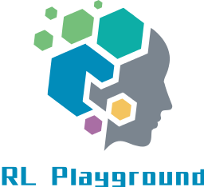
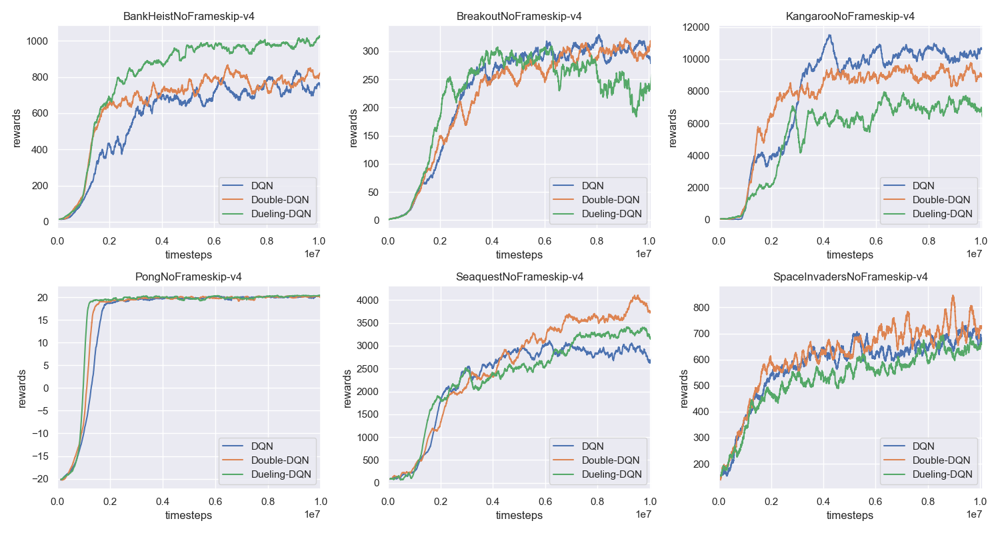
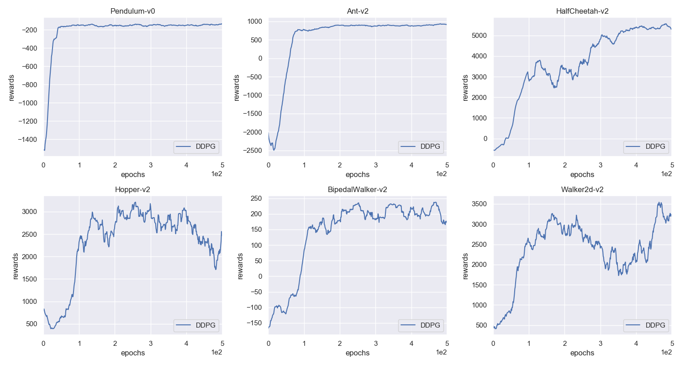
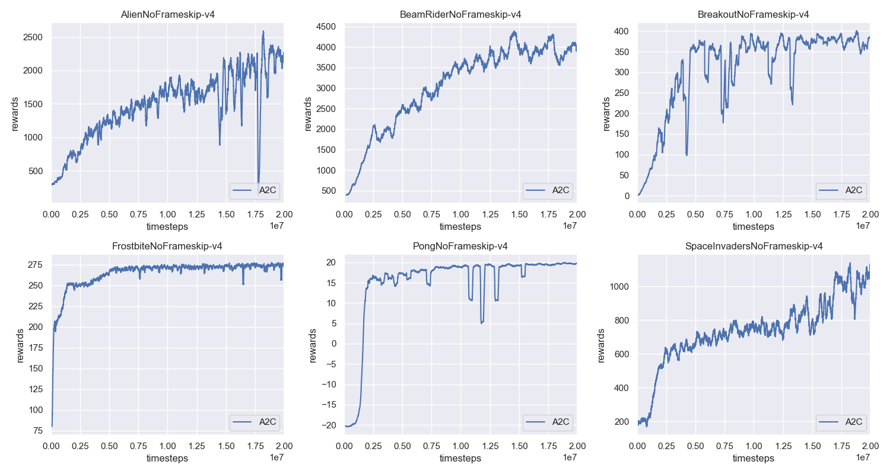
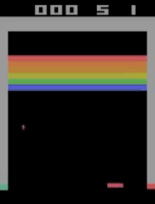
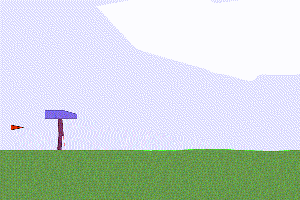
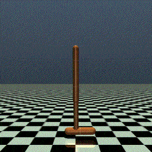

# Deep Reinforcement Learning Algorithms
  
&nbsp;  
  
This repository will implement the classic deep reinforcement learning algorithms by using **PyTorch**. The aim of this repository is to provide clear code for people to learn the deep reinforcemen learning algorithms. In the future, more algorithms will be added and the existing codes will also be maintained. 
## Current Implementations 
- [x] Deep Q-Learning Network (DQN)
    - [x] Basic DQN
    - [x] Double Q network
    - [x] Dueling Network Archtiecure
- [x] Deep Deterministic Policy Gradient (DDPG)
- [x] Advantage Actor-Critic (A2C)
- [x] Trust Region Policy Gradient (TRPO)
- [x] Proximal Policy Optimization (PPO)
- [ ] Actor Critic using Kronecker-Factored Trust Region (ACKTR)
- [ ] Soft Actor Critic (SAC)
## Update Info
:triangular_flag_on_post: **2018-10-17** - In this update, most of algorithms have been imporved and **add more experiments with plots** (except for DPPG). The **PPO** now supports **atari-games** and **mujoco-env**. The **TRPO** is much stable and can have better results!  
&nbsp;  
:triangular_flag_on_post: **2019-07-15** - In this update, the installation for the openai baseline is no longer needed. I have intergated useful functions in the **rl__utils** module. DDPG is also re-implemented and support more results. README file has been modified. The code structure also has tiny adjustment.  
&nbsp;  
:triangular_flag_on_post: **2019-07-26** - In this update, the revised repository will be public. In order to have a light size of the repository. I **rebuild** the repository and the previous version is deleted. But I will make a backup in the google driver.
## TODO List
- [ ] add prioritized experience replay.
- [x] in the future, we will not use openai baseline's pre-processing functions.
- [x] improve the **DDPG** - I have already implemented a pytorch Hindsight Experience Replay (HER) with DDPG, you chould check them [here](https://github.com/TianhongDai/hindsight-experience-replay).
- [ ] update pre-trained models in google driver (will update soon!).
## Requirments
- pytorch=1.0.1
- gym=0.12.5
- mpi4py
- mujoco-py
## Installation
1. Install our `rl_utils` module:
```bash
pip install -e .
```
2. Install mujoco: please follow the instruction of [official website](https://github.com/openai/mujoco-py).
3. Instll Box2d:
```bash
sudo apt-get install swig or brew install swig
pip install gym[box2d]
pip install box2d box2d-kengz
```
## Instruction
1. Train the agent (details could be found in each folder):
```
cd target_algo_folder/
python train.py --<arguments you need>
```
2. Play the demo:
```
cd target_algo_folder/
python demo.py --<arguments you need>
```
## Code Structures
1. **rl algorithms**:
 - `arguments.py`: contain the parameters used in the training.
 - `<rl-name>_agent.py`: contain the most important part of the reinforcement learning algorithms.
 - `models.py`: the network structure for the policy and value function.
 - `utils.py`: some useful function, such as **select actions**.
 - `train.py`: the script to train the agent.
 - `demo.py`: visualize the trained agent.
2. **rl_utils** module:
 - `env_wrapper/`: contain the pre-processing function for the atari games and wrapper to create environments.
 - `experience_replay/`: contain the experience replay for the off-policy rl algorithms.
 - `logger/`: contain functions to take down log infos during training.
 - `mpi_utils/`: contain the tools for the mpi training.
 - `running_filter/`: contain the running mean filter functions to normalize the observation in the mujoco environments.
 - `seeds/`: contain function to setup the random seeds for the training for reproducibility.
## Example Results
### 1. DQN algorithms

### 2. DDPG 

### 3. A2C

### 4. TRPO

### 5. PPO


## Demos
Atari Env (BreakoutNoFrameskip-v4)| Box2d Env (BipedalWalker-v2)| Mujoco Env (Hopper-v2)
-----------------------|-----------------------|-----------------------|
| | 
## Acknowledgement
- [Ilya Kostrikov's GitHub](https://github.com/ikostrikov)
- [Openai Baselines](https://github.com/openai/baselines)
- [Kai's suggestions to simplify MPI functions](https://github.com/Kaixhin)

## Related Papers
[1] [A Brief Survey of Deep Reinforcement Learning](https://arxiv.org/abs/1708.05866)  
[2] [The Beta Policy for Continuous Control Reinforcement Learning](https://www.ri.cmu.edu/wp-content/uploads/2017/06/thesis-Chou.pdf)  
[3] [Playing Atari with Deep Reinforcement Learning](https://www.cs.toronto.edu/~vmnih/docs/dqn.pdf)  
[4] [Deep Reinforcement Learning with Double Q-learning](https://arxiv.org/abs/1509.06461)  
[5] [Dueling Network Architectures for Deep Reinforcement Learning](https://arxiv.org/abs/1511.06581)  
[6] [Continuous control with deep reinforcement learning](https://arxiv.org/abs/1509.02971)  
[7] [Continuous Deep Q-Learning with Model-based Acceleration](https://arxiv.org/abs/1603.00748)  
[8] [Asynchronous Methods for Deep Reinforcement Learning](https://arxiv.org/abs/1602.01783)  
[9] [Trust Region Policy Optimization](https://arxiv.org/abs/1502.05477)  
[10] [Proximal Policy Optimization Algorithms](https://arxiv.org/abs/1707.06347)  
[11] [Scalable trust-region method for deep reinforcement learning using Kronecker-factored approximation](https://arxiv.org/abs/1708.05144)  
